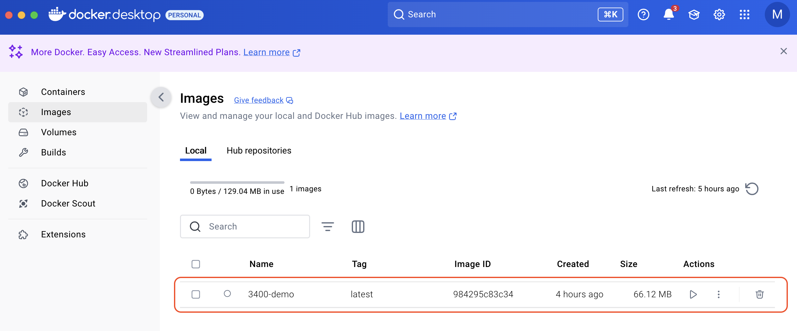
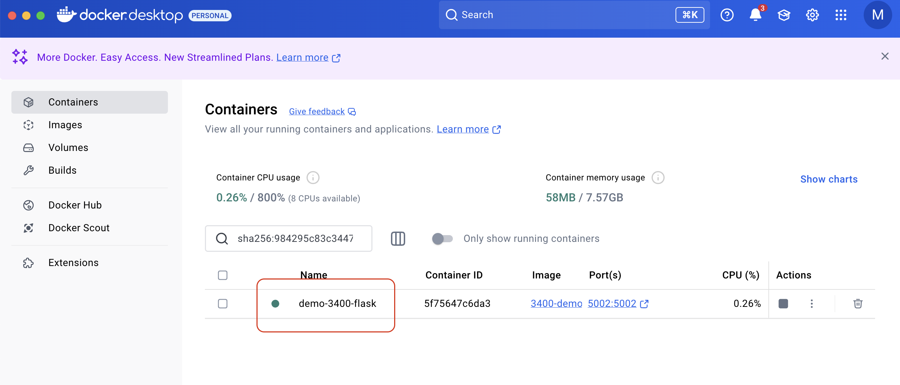

# 3400-docker-demo

Docker application for demonstrating Docker functionality in BAIS:3400 Cloud Computing

  

TODO:
[] Redesign this demo applicaiton to have a Data Science focus.

## Creating a Docker image & container

Install [Docker Desktop](https://www.docker.com/products/docker-desktop/)

1. Create .dockerignore file.
2. Create Dockerfile.
3. Create /src files & folders.

### Create an image

From terminal, within the correct directory `cd Documents/GitHub/3400-docker-demo`
run `docker build -t 3400-flask-demo .`

-t followed by _imagename_  
 . is location of Dockerfile. In this case the root of this directory.

You should now see your Docker image on Docker Desktop.


### Create a container

Next, run `docker run --name="demo-frontend-flask" -p 5002:5002 3400-flask-demo`

- This runs the container with the name _"demo-frontend-flask"_.
- Exposes 5002 on the host : to port 5002 in Docker. This port was chosen in app.py.
- Uses the _3400-demo_ Docker image to make the container.



Use names that are conistent, descriptive, and meaningful such as

- myapp_frontend_nginx
- myapp_backend_api
- myapp_database_postgres

### List containers

To see running containers `docker container ls`  
or  
`docker ps --format "table {{.ID}}\t{{.Names}}\t{{.Image}}\t{{.Status}}"`

### Access the application

From the browser:
`http://localhost:5002` or `http://127.0.0.1:5002`

For others to connect to you application, find your IP address `ifconfig`  
then `http://<your ip>:5002`

The 172.17.x.x address is specific to the Docker environment.

## Putting the image in Azure Container Registry

### Install the Azure CLI tools

https://learn.microsoft.com/en-us/cli/azure/install-azure-cli-macos

Use Homebrew to install them on Mac.  
`brew update && brew upgrade azure-cli`

### Create an Azure Container Registry

Login using `az login` at the command line. It opens a browser window to complete login.

Choose the correct subscription. Press `Enter` for default, or choose your subscription with
`az account set --subscription "Pay-As-You-Go"`

#### Create a Resource Group

`az group create --name colbert-container-demo-rg --location eastus`

> To find a list of all locations: `az account list-locations -o table`

> To find a list of US locations, excluding (STAGE), STG, and EUAP which are "Stage" are used internally by Azure for testing, previewing new features, or validating deployments before general availability and not meant for production deployments.

```bash
az account list-locations \
  --query '[?contains(regionalDisplayName, `(US)`) && !contains(regionalDisplayName, `(Stage)`) && !contains(regionalDisplayName, `STG`) && !contains(regionalDisplayName, `EUAP`)].{Name:name, DisplayName:displayName, RegionalDisplayName:regionalDisplayName} | sort_by(@, &DisplayName)' \
  -o table
```

#### Create an Azure Container Registry

`az acr create --resource-group colbert-container-demo-rg --name colbertcontainerdemoacr --sku Basic`

Use Azure CLI to create a Container Registry and place it in your resource group.

ACR tier information: https://docs.microsoft.com/en-us/azure/container-registry/container-registry-skus

The ACR name can be 5 - 50 alphanumeric characters and must be unique across Azure.

#### Login to the registry

Ensure Docker Desktop is running in the background on your computer, then:

`az acr login --name colbertcontainerdemoacr`

#### Tag the image you want to push

If you are on a Mac, you need to build a multi-architecture image:

Make sure `FROM --platform=linux/amd64 python:3.12-alpine3.21` , then

run ` docker buildx build --platform linux/amd64 -t 3400-flask-demo:latest .`

Tag the image you want to push with the fully qualified name of your container registry service using `docker tag`.  
`docker tag 3400-flask-demo:latest colbertcontainerdemoacr.azurecr.io/3400-flask-demo:latest`

Push the image to Azure Container Registry using `docker push`
`docker push colbertcontainerdemoacr.azurecr.io/3400-flask-demo:latest`

### Deploy with and App Service Plan and App Service

https://earthly.dev/blog/arm-containers-github-actions/

https://learn.microsoft.com/en-us/azure/container-registry/container-registry-authentication?tabs=azure-cli#admin-account

https://jonnychipz.com/2021/02/22/create-and-push-a-docker-image-to-azure-container-registry/comment-page-1/

https://jonnychipz.com/2021/03/02/creating-azure-devops-build-pipelines-to-deploy-container-image-into-azure-app-service/

https://learn.microsoft.com/en-us/azure/app-service/tutorial-custom-container?tabs=azure-cli&pivots=container-linux#vi-configure-the-web-app

https://hub.docker.com/_/python

https://learn.microsoft.com/en-us/azure/container-registry/container-registry-skus

https://www.digitalocean.com/community/tutorials/how-to-build-and-deploy-a-flask-application-using-docker-on-ubuntu-20-04

https://hub.docker.com/r/tiangolo/uwsgi-nginx-flask

https://www.freecodecamp.org/news/how-to-dockerize-a-flask-app/

https://luis-sena.medium.com/creating-the-perfect-python-dockerfile-51bdec41f1c8

https://www.docker.com/blog/how-to-dockerize-your-python-applications/

https://hasura.io/blog/how-to-write-dockerfiles-for-python-web-apps-6d173842ae1d

https://depot.dev/blog/docker-build-image

https://depot.dev/docs/container-builds/how-to-guides/optimal-dockerfiles/python

#### Docker for Data Science

https://datasciencedojo.com/blog/docker-for-data-science/#:~:text=The%20concept%20of%20Docker%20for,and%20reproducibility%20across%20different%20environments

https://www.datacamp.com/tutorial/docker-for-data-science-introduction

https://www.kdnuggets.com/2023/08/simple-docker-data-science-image.html

https://towardsdatascience.com/intro-to-docker-containers-for-data-scientists-dda9f2cfe66e/

https://medium.com/@tam.tamanna18/dockerizing-data-science-96607fec5443

https://valohai.com/blog/docker-for-data-science/

https://fastapi.tiangolo.com/deployment/docker/

https://github.com/visenger/awesome-mlops
